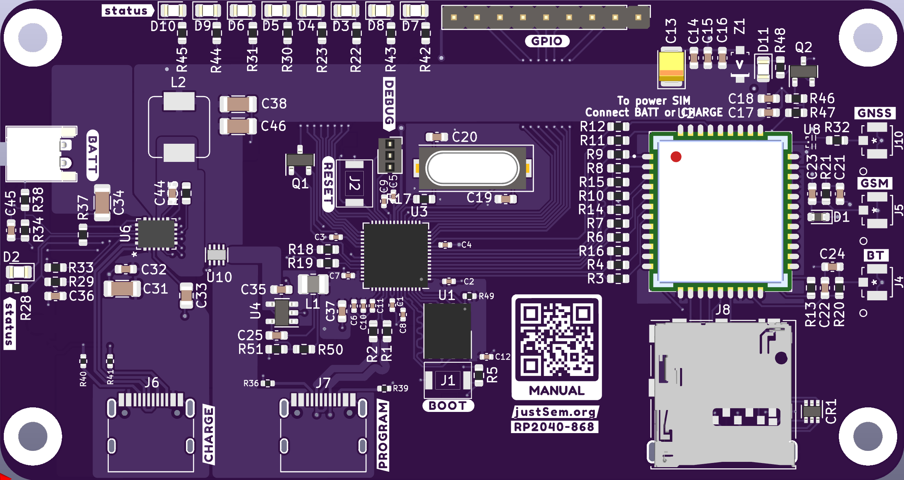

# RP2040-868
A GPRS/GNSS/BTLE and LiPo/Li-ion charger integrated Pi Pico on credit-card format.

Title says it all!
This is a fully integrated RP2040-based board featuring the following:

* GPRS Enabled (with microSIM card format)
* GNSS (GPS, GLONASS, BEIDOU)
* BT(LE)
* Integrated LiPo/Li-ion charging circuit.
* USB-C (in USB2.0 mode) ports for future proofing.
* Programmable as if it's a "normal" RPI Pico
* Auto-switching power source: In case you connect both the Battery/USB Power and the USB-Program port, the device will automatically switch it's power source to the "PROG" port.

## Details
This board aims to be as easy-to-use as an ordinary RPi Pico, meaning you can program it in exactly the same way.

## Quick Start
If you have the board you can simply access the programming mo
