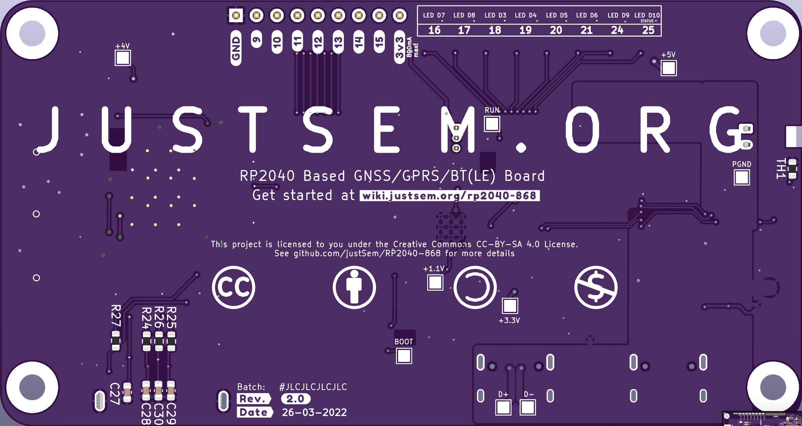

> `BE AWARE` This project is still in active development, I'm still in the process of ordering and testing prototypes, so the latest version is not tested to be fully-working as of yet.

# RP2040-868
A GPRS/GNSS/BTLE and LiPo/Li-ion charger integrated Pi Pico on credit-card format.

_Size: 99x50mm_

Title says it all!

This is a fully integrated RP2040-based board featuring the following:

* GPRS Enabled (with microSIM card format)
* GNSS (GPS, GLONASS, BEIDOU)
* BT(LE)
* Integrated LiPo/Li-ion charging circuit.
* USB-C (in USB2.0 mode) ports for future proofing.
* Programmable as if it's a "normal" RPI Pico
* Auto-switching power source: In case you connect both the Battery/USB Power and the USB-Program port, the device will automatically switch it's power source to the "PROG" port.

## The boards origin
Me and my friends work with GPS trackers a lot, for various purposes. For a while we used cheap AliExpress trackers, but we felt they couldn't be fully trusted. They're dirt-cheap but in return, closed-source.
We had absolutely no guarantee that it won't secretly send our data back to China.
So I decided to make our own version.

What started as a simple board grew out to be a fully-programmable board.
Since most of our group favor Python over C++ (simply because we're more used to Python :) ) we went with an RP2040

## Board Details
* The charger is a Monolithic Power [MP2624](https://www.monolithicpower.com/en/mp2624.html) 
* The GPRS/GNSS/BT(LE) Module is a SIMCom [SIM868](https://datasheet.lcsc.com/lcsc/1811011410_SIMCom-Wireless-Solutions-SIM868_C89549.pdf)
* At the heart of the board you'll find a Raspberry Pi [RP2040](https://datasheets.raspberrypi.com/rp2040/rp2040-datasheet.pdf)

## Quick Start
If you have the board you can simply access the programming mode by going through the following steps:
1. Connect a USB-C cable to the port labeled `PROG`
2. Press and hold the `RESET` button
3. Pres and hold the `PROG` button
4. Release the `RESET` button
5. Release the `PROG` button

The device should now present itself as removable storage to your system, allowing you to upload/download files to/from it.
You can use the provided code for some working examples.

## Costs
I haven't exactly calculated the costs. But for the 5 prototypes I built I spent roughly 30 euro's/board.
This includes overhead as some components had a minimium buy of 100 pieces.
So the exact costs are most likely below the number mentioned above.

# Planned Future
The plan is to make some changes in the future, these changes could be:

__Move to another Cellular Chip__

The SimCom chips can have 2A peak currents, which require a pcb designed to accomodate said currents.

__Support for more modern cellular acces__

GPRS is soon to be EOL. But at the time of writing there are no subsitutes which are worth the price in this project.
3G chips are available, but those networks are to be turned off 03-2022 in this country, which makes them not suitable for this project.
LTE-M (or other IoT bands) are still only available to commercial customers, chips for these networks are readily available but sadly not usable in this country.

For now it's waiting to see if any decent substitute will become available in the upcoming months.

__Support NanoSIM__

While it's theoretically possible with Rev 1.1 of the board, it hasn't been tested as of yet.

# F.A.Q.

__Do you sell these boards?__

No. I have no commercial interest with this project, but I might have spares at times, which I might be willing to send as long as you cover the costs.
Feel free to reach out if you're interested.

__Can you implement feature X?__

You're free to implement any software feature yourself. The boards are programmable for a reason :)

The board files can be altered using KiCad, enabling you to make hardware changes as well.

__I found a flaw__

Great! Please open an [issue](/issues/new/choose) and describe what you found.

# DISCLAIMER
I am in no way a professional PCB designer - this design could be flawed without me being aware of it.
I make things as a hobby without any guarantee on functionality, compatibility or reliability.
As stated in the [License](LICENSE.md) this product comes without any guarantee.
